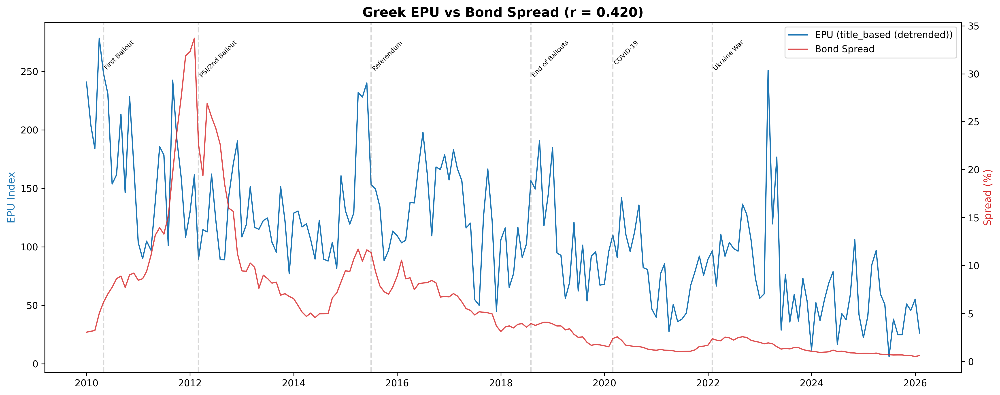
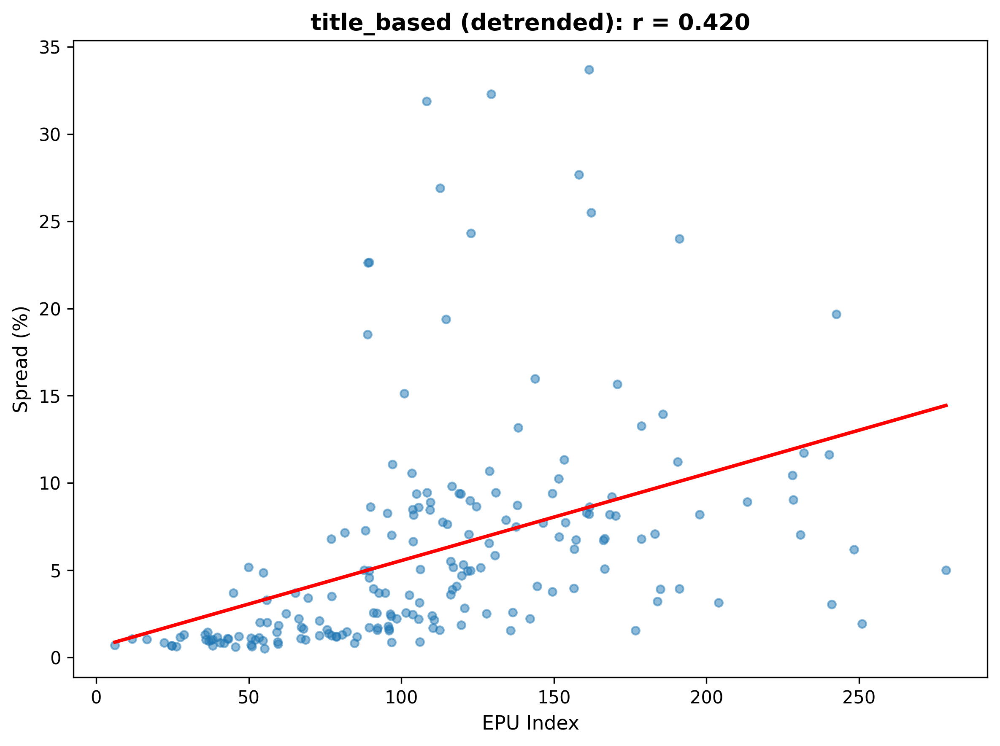
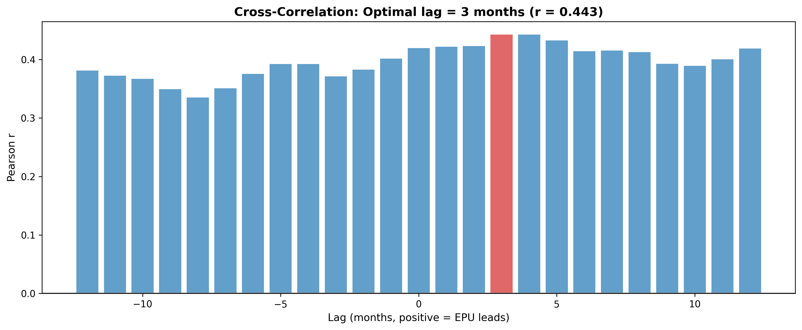

# Greek Economic Policy Uncertainty Index (EPU)

**Measuring policy uncertainty in Greece through newspaper text analysis (2010–2026)**

[](https://www.python.org/)
[](LICENSE)

---

## Overview

This project constructs a monthly **Economic Policy Uncertainty (EPU) index** for Greece by applying NLP techniques to ~1.5 million Greek newspaper articles spanning 2010–2026. The methodology follows [Baker, Bloom & Davis (2016)](https://www.policyuncertainty.com/media/BakerBloomDavis.pdf) and extends it with context-aware weighting, bigram detection, and sentiment analysis adapted for the Greek language.

The index is validated against the **Greece–Germany 10-year government bond spread**, a widely used market measure of sovereign risk.


*Figure 1: Greek EPU Index vs. Bond Spread (2010–2026). Key events annotated.*

## Key Results

| Metric | Value |
|---|---|
| Pearson correlation (EPU vs. spread) | **0.420** (p < 0.001) |
| Spearman correlation | **0.684** (p < 0.001) |
| Optimal cross-correlation lag | **+3 months** (EPU leads) |
| Bivariate R² | 0.176 |
| Multivariate R² (with AR(1) + trend) | **0.954** |
| EPU coefficient in multivariate model | **significant at p = 0.04** |

The EPU index retains statistical significance even after controlling for lagged spread and a linear trend, meaning that newspaper-based uncertainty captures **new information not already priced into bond markets**.

## Methodology

### 1. Data & Filtering

- **Source:** ~1,497,000 Greek newspaper articles (2010–2026)
- **Filtering:** Strict quality checks removed ~24% of malformed entries (web scraping artifacts)
- **Final sample:** ~1,137,000 clean articles

### 2. NLP Pipeline

Articles are classified as EPU-relevant if they simultaneously contain keywords from three categories:

- **Uncertainty** — stems like *αβεβαι-* (uncertainty), *κρίσ-* (crisis), *κίνδυν-* (risk), *αστάθει-* (instability)
- **Economy** — stems like *οικονομ-* (economy), *τραπεζ-* (bank), *ομόλογ-* (bond), *πληθωρισμ-* (inflation)
- **Policy** — stems like *κυβέρνησ-* (government), *μνημόνι-* (memorandum/bailout), *εκλογ-* (election), *eurogroup*

On top of the basic keyword intersection, the pipeline applies three noise-reduction layers:

1. **Context Window (±5 words):** Each uncertainty keyword is analyzed in its local context. Negators (*δεν*, *χωρίς*) suppress the keyword (×0), diminishers (*βελτιώθηκε*, *λύθηκε*) reduce it (×0), and amplifiers (*κλιμακώνεται*, *εντείνεται*) double it (×2). A negated diminisher restores the signal (×1.5).

2. **Bigram Detection:** Domain-specific compound phrases like *κρίση χρέους* (debt crisis), *capital controls*, *μέτρα λιτότητας* (austerity measures), and *κούρεμα ομολόγων* (bond haircut) receive additional weight.

3. **Loughran-McDonald Sentiment:** A Greek-adapted version of the LM financial sentiment lexicon scores each article's tone, with more negative articles receiving a higher uncertainty weight.

### 3. Index Construction

Eight alternative indices were tested. The final choice — **title-based (detrended)** — was selected for its combination of high correlation and robustness:

| Method | Pearson r | Spearman r |
|---|---|---|
| Basic (detrended) | −0.117 | 0.241 |
| Context Weighted (detrended) | −0.345 | −0.140 |
| Sentiment LM (detrended) | 0.039 | 0.323 |
| Title+Content (detrended) | −0.095 | 0.257 |
| Ultimate (detrended) | 0.152 | 0.455 |
| Bigram (detrended) | 0.229 | 0.560 |
| Title+Bigram (detrended) | 0.416 | 0.737 |
| **Title-Based (detrended) ★** | **0.420** | **0.684** |

Linear detrending corrects for the secular increase in article volume over time, which would otherwise inflate the index and create spurious correlation.

### 4. Validation


*Figure 2: Scatter plot — EPU vs. Bond Spread*


*Figure 3: Cross-correlation analysis. The EPU index leads the bond spread by 3 months.*

**OLS regressions** (Newey-West HAC standard errors, 6 lags):

- **Bivariate:** `Spread = 0.57 + 0.050 × EPU` — R² = 0.176, p < 0.001
- **Multivariate:** `Spread = 0.21 + 0.004 × EPU + 0.941 × Spread(t-1) − 0.004 × Trend` — R² = 0.954, EPU p = 0.040

The Durbin-Watson statistic improves from 0.17 (bivariate) to 1.52 (multivariate), confirming that the AR(1) term adequately addresses autocorrelation.

## Repository Structure

```
greek-epu-index/
├── README.md
├── LICENSE
├── requirements.txt
├── src/
│   └── epu_pipeline.py          # Full NLP + econometrics pipeline
├── data/
│   └── epu_timeseries.csv       # Final monthly EPU index
└── figures/
    ├── 01_epu_vs_spread.png     # Time series comparison
    ├── 02_scatter_best.png      # Scatter plot
    └── 03_cross_correlation.png # Cross-correlation chart
```

> **Note:** The raw newspaper dataset (~1.5M articles) is not included due to size and licensing constraints. The pipeline script (`src/epu_pipeline.py`) documents the full processing logic.

## Quickstart

```bash
git clone https://github.com/NicholasKounelakis/greek-epu-index.git
cd greek-epu-index
pip install -r requirements.txt
```

To reproduce the analysis (requires the raw newspaper CSVs and bond spread Excel file):

```bash
python src/epu_pipeline.py
```

## Tech Stack

- **Python** — pandas, NumPy, statsmodels, SciPy, matplotlib
- **NLP** — Custom Greek morphological stem matching, context-window analysis, bigram detection
- **Econometrics** — OLS with HAC (Newey-West) standard errors, cross-correlation analysis

## References

- Baker, S. R., Bloom, N., & Davis, S. J. (2016). *Measuring Economic Policy Uncertainty.* The Quarterly Journal of Economics, 131(4), 1593–1636.
- Loughran, T., & McDonald, B. (2011). *When Is a Liability Not a Liability? Textual Analysis, Dictionaries, and 10‑Ks.* The Journal of Finance, 66(1), 35–65.

## License

MIT License — see [LICENSE](LICENSE) for details.

## Authors

**QuantBros** — Undergraduate project, *"Text as Data in Economics: The Power of AI"*, March 2026
